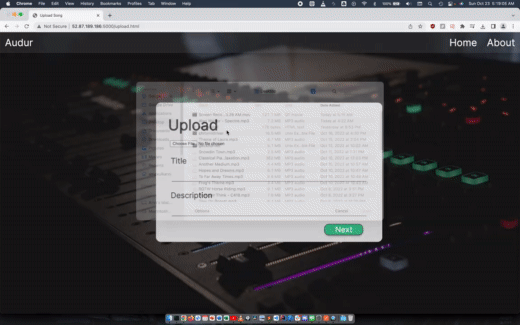

# Audur

## Project Summary
`Audur` was built by three teammates under 36 hours as part of [`HackGT 9`](https://2022.hack.gt/). The application is a web application that eases the process of sharing audio files with one another while mantaining one's anonymity. When entering the site, users can upload an audio file, providing a title and descripition with it. Following this, the audio will be stored onto an Amazon EC2 cloud instance and be associated with a unique identifier. A shareable link is then generated using the TinyURL API which the user can send to others.

  

## Why We Built Audur?
In creating the idea for Audur, we were heavily inspired by the popular image-sharing service called Imgur which allows users to share images without the need of creating an account or logging in beforehand. Although services like Google Drive and Soundcloud are popular means of sharing files, they come with the downside of having to login - thereby tying the files to the user, which can potentially leave the user’s information exposed. So, we wanted to create an alternative way to share audio files that is both quick and more secure.

## How Did We Build Audur?
We first designed a basic prototype of the web app using Figma. Then, we charted out the implementable and feasible features. From here, we focused our energy on building the backend to enable users to upload audio files using form actions. This enabled us to ensure that we could generate a unique link for each upload. After verifying the functionality of the backend, we built the front-end and styled the pages.

## Challenges We Ran Into
We were initially going to use a Google Cloud instance to host the application. However, this proved to be troublesome, as the initial setup and the restrctions on the UI were difficult to mitigate. In addition, the rules for setting up firewalls were unclear, and did not provide us with many choices. We also considered using Firebase's storage to store the files and generate the URL, but then quickly realized that AWS best suited the application's needs. We were able to navigate through the console with ease and fearlessly experiment with powerful virtual machines due to the large budget ($400.00). Despite these challenges, we quickly learned when something was not feasible to implement and were able to mine efficient alternatives.

## Next Steps for Audur
One of the main limitations of Audur that we've quickly noticed was that the frontend UI could be a bit more intuitive. Audur's design could make better use of responsive design, so that the app can be aesthetically appealing on screens of different devices. We would like to implement a feed section, where users can check the trending audio clips, and view similar content from our recommendations.

## Demo Video

https://user-images.githubusercontent.com/83044307/208280802-286ce63d-0694-496e-ade3-fbdfd78a3524.mp4

## Contacts
- [Amit Kulkarni (Full Stack Developer)](https://github.com/amitkulk123)
- [Preetham Thelluri (Backend Developer)](https://github.com/preethamcoder)
- [Rian Rahman (Frontend Developer)](https://github.com/RiRah123)
